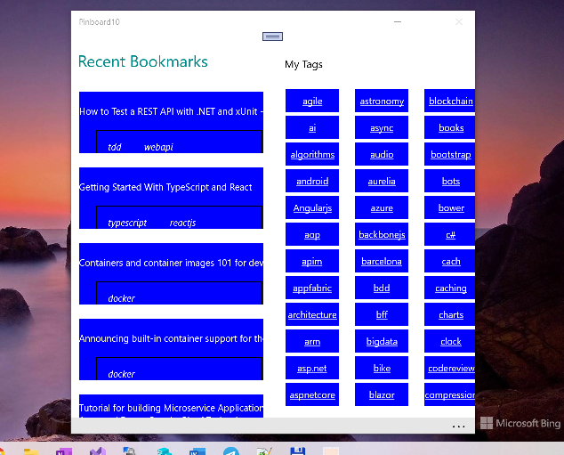

# Pinboard10

My fork of Pinboard8 project for a little RnD / win10/win10mobile uwp renovation :)

## About 

This is UWP Client for Pinboard.in site (used api.pinboard.in web service).

## Screenshots

## Status

- R.E./Dev. approx. 15-20 % 
- Not completed yet
- No multi-platform (No Android, no iOS..)

## How-to / DIY
If you have some dev. chakra and have no money, contact the support for some trial days and sign-up at pinboard.in.
Go to API, grab your client_id / client_secret.
If you don't want this login attraction, leave geraintj's credentials in code (but don't damage his "pinboard"))) 

## Referencies

https://github.com/geraintj/Pinboard8

https://pinboard.in/api/

## ..

AS IS. No support. For ed. purposes only. DIY

## .
- m e 2 0 2 2